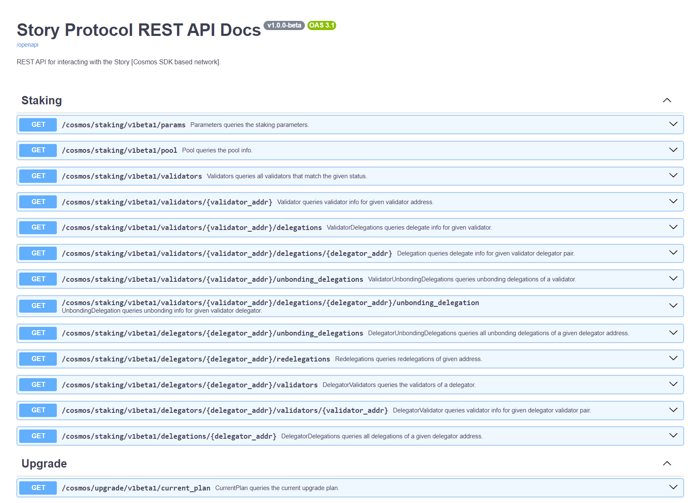

### 1. Update and install required packages
```bash
sudo apt update && sudo apt install python3 python3-venv git -y
```
### 2. Clone the repository
```bash
git clone https://github.com/trusted-point/Story-Rest-API.git
```
### 3. Activate virtual enviarment
```bash
cd Story-Rest-API
python3 -m venv venv
source venv/bin/activate
```
#### 4. Install dependencies
```bash
pip3 install -r requirements.txt
```
### 5. Edit `config.yaml` if needed
It's important to specify correct Story rpc url (e.g. http://127.0.0.1:29659).

You can also customize logs settings, disable/enable swagger etc.
```bash
nano config.yaml
```
### 6. Start the app
```bash
uvicorn main:app --host 0.0.0.0 --port 8085 --workers 1
# Increasing the number of --workers allows the application to handle more concurrent requests
```

### 7. Start the app in the background (Optional)
```bash
sudo tee /etc/systemd/system/story-rest-api.service > /dev/null <<EOF
[Unit]
Description=Story REST API
After=network.target
WorkingDirectory=$HOME/Story-Rest-API

[Service]
User=$USER
Type=simple
ExecStart=$(which uvicorn) main:app --host 0.0.0.0 --port 8085 --workers 1
Environment="CONFIG_PATH=$HOME/Story-Rest-API/config.yaml"
Environment="LOGPATH=$HOME/Story-Rest-API/logs/logs.log"
Environment="PYTHONPATH=$HOME/Story-Rest-API"
Restart=on-failure

[Install]
WantedBy=multi-user.target
EOF
```
```bash
sudo systemctl daemon-reload && \
sudo systemctl enable story-rest-api && \
sudo systemctl start story-rest-api
```
```bash
sudo journalctl -u story-rest-api -f -o cat
```
```bash
[2024-09-18 22:56:09] |   WARNING | 🔥 Log file size to trigger the rotation: 10MB.
[2024-09-18 22:56:09] |   INFO    | ------------------------------------------------------
[2024-09-18 22:56:09] |   WARNING | 📂 Log file backups count: 3
[2024-09-18 22:56:09] |   INFO    | ------------------------------------------------------
[2024-09-18 22:56:09] |   INFO    | Started server process [1049719]
[2024-09-18 22:56:09] |   INFO    | Waiting for application startup.
[2024-09-18 22:56:09] |   INFO    | Application startup complete.
[2024-09-18 22:56:09] |   INFO    | Uvicorn running on http://0.0.0.0:8085 (Press CTRL+C to quit)
[2024-09-18 22:57:03] |   INFO    | 83.5.253.240:50929 - "GET / HTTP/1.1" 200
[2024-09-18 22:57:04] |   INFO    | 83.5.253.240:50929 - "GET /openapi HTTP/1.1" 200
[2024-09-18 22:57:30] |   INFO    | 83.5.253.240:50930 - "GET /cosmos/staking/v1beta1/params HTTP/1.1" 200
[2024-09-18 22:57:45] |   INFO    | 83.5.253.240:50949 - "GET /cosmos/staking/v1beta1/pool HTTP/1.1" 200
[2024-09-18 22:57:49] |   INFO    | 83.5.253.240:50949 - "GET /cosmos/staking/v1beta1/validators HTTP/1.1" 200
[2024-09-18 22:57:56] |   INFO    | 83.5.253.240:50955 - "GET /cosmos/upgrade/v1beta1/current_plan HTTP/1.1" 200
[2024-09-18 22:58:01] |   INFO    | 83.5.253.240:50955 - "GET /cosmos/bank/v1beta1/supply HTTP/1.1" 200
[2024-09-18 22:58:02] |   INFO    | 83.5.253.240:50955 - "GET /cosmos/bank/v1beta1/supply HTTP/1.1" 200
[2024-09-18 22:58:10] |   INFO    | 83.5.253.240:50956 - "GET /cosmos/distribution/v1beta1/params HTTP/1.1" 200
```

## You can now access swagger on http://IP:PORT

[]()